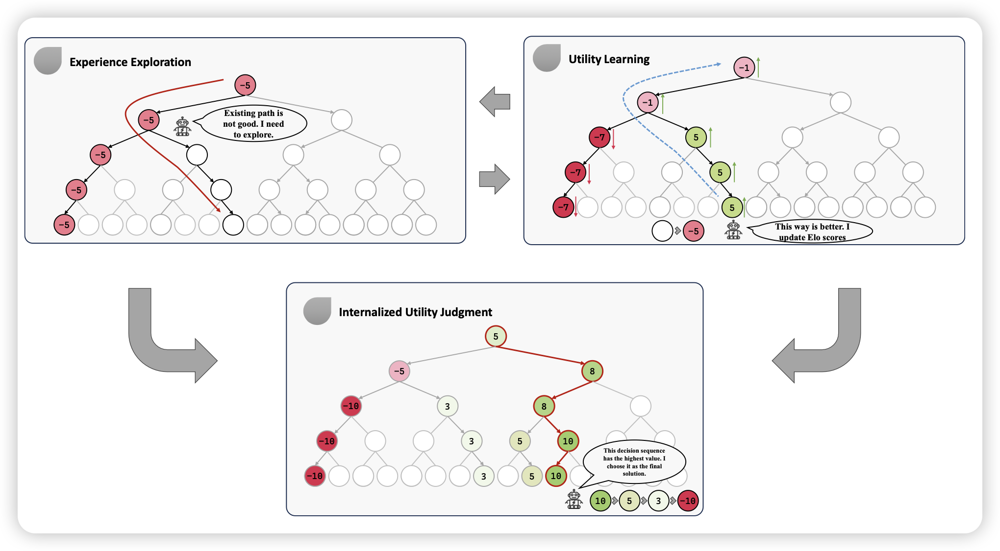

# Overview

This is the official implementation of the paper [Rational Decision-Making Agent with Internalized Utility Judgment](https://arxiv.org/abs/2308.12519)

You can connect yeyn2001@gmail.com if you have any problems of running RaD-Agent.



With remarkable advancements, large language models~(LLMs) have attracted significant efforts to develop LLM-based agents capable of executing intricate multi-step decision-making tasks. Existing approaches predominantly build upon the external performance measure to guide the decision-making process but the reliance on the external performance measure as prior is problematic in real-world scenarios, where such prior may be unavailable, flawed, or even erroneous.For genuine autonomous decision-making for LLM-based agents, it is imperative to develop rationality from their posterior experiences to judge the utility of each decision independently. For genuine autonomous decision-making for LLM-based agents, it is imperative to develop rationality from their posterior experiences to judge the utility of each decision independently.

In this work, we propose **Ra**tional **D**ecision-Making **Agent**(RaD-Agent), which fosters the development of its rationality through an iterative framework involving experience Exploration and Utility Learning. Within this framework, a LLM-based rating system is devised to assign Elo scores to individual decision steps to judge their utilities via pairwise comparisons.  Consequently, these Elo scores guide the decision-making process to derive optimal outcomes.

Experimental results on the Game of 24, WebShop, and ToolBench dataset demonstrate RaD-Agent's superiority over baselines, achieving about 9.3% improvement on average. Besides, RaD-Agent  also can reduce costs (ChatGPT API calls), highlighting its effectiveness and efficiency. 

# Running

Here is the guideline of how to run ETS method in different downstream-tasks.

You need to first clone the repo and install the project dependency:

```bash
python -m pip install -e ./
```

Then, before you start, you need to put your OpenAI API Keys in someplace of the Repo.

- `./LLM/openai_0613.py`, here you need to write the `api_key, base_url, pool`. This is the main entrace to query the OpenAI Engine.
- `./test_codes/MCTS.py`, here you need to write `api_key, base_url`，if you want to implement a LLM-Based MCTS baseline.


Then, to run on the downstream tasks we report in the paper, use the following guides.

## 1. Webshop

### Start Server

run the following commands:

```bash
cd run_webshop
python env_server.py
```

The IP and port can be set in `env_server.py`.

```
host = "localhost" # your host ip
port = 12348 # your host port
```

### Run Benchmark

```bash
cd run_webshop
bash run_task.sh
```

You can set the connection ip and port in `run_webshop\webshopping_env_online.py`.

### Evaluation

```bash
cd run_webshop
bash eval.sh
```


## 2. RestGPT

Configure the REST API environment (TMDB, Spotify) by following the instructions in [RestGPT](https://github.com/Yifan-Song793/RestGPT).

### Start Server

run the following commands:

```bash
cd run_restbench
python env_server.py
```

The IP and port can be set in `env_server.py`.

```
host = "localhost" # your host ip
port = 12348 # your host port
```

### Run Benchmark

```bash
cd run_restbench
bash run_task.sh
```

You can set the connection ip and port in `run_restbench\restbench_env.py`.

### Evaluation

```bash
cd run_restbench
python restbench_eval.py
```


## 3. Game of 24

#### LLM-Based Baseline

We follow the setting of [ToT](https://arxiv.org/abs/2305.10601), which uses a `./Downstream_tasks/24.csv` and test the last 100 problems, which is the hardest in the dataset. Then, you can run the experiment:

```
python ./test_codes/test_24.py
```

You need to specify some arguments like input or output dir, process_num, in that python file. This code is not only for Elo-tree-search, you can also specify DFS, DFSDT, BFS method in the `--method` part.

#### MCTS baseline

Also, we implement an MCTS baseline, based on the traditional UCT tree-search method, it has different versions, the difference in `get_reward` function, you can specify it. To run the baseline, use the follow command:

```
python ./test_codes/MCTS.py
```

> MCTS can also finds a result of each case, but it uses 100 times more simulations than ETS. We give a compare in our paper.

## 4. ToolBench

To test on Toolbench, it is a little complex. You need to first Start a ToolServer following the guide [here](https://github.com/OpenBMB/ToolBench), also you can build it [locally](https://drive.google.com/file/u/0/d/1JdbHkL2D8as1docfHyfLWhrhlSP9rZhf/view?usp=sharing&pli=1)

After setting up toolserver, you can set the toolserver-url in `answer_generation.py` line 272, and then run the commands: 

```bash
python answer_generation.py
```


In our experiment, we use this split```./assetstoolbench_test_data_0925/test_query_ids```,


## Elo-Tree Search Hyperparameter explanation

here, we just parse your method name, and specify it into some format ETS method such as `ETS_all-100_annealing_k50_sqrt_s100_f1_t173.72_p0.9_c15_m3_rn1_rg3`. we mainly split the name by "_", the logic is at `./test_codes/test_24.py`, line 340-380

- ETS means Elo-base Tree Search, the main method of RaD-Agent
- K50, means how to update the elo score in the equation. bigger k means to update elo score fastly. We set this to 50 in all the experiment
- s100, means we will give 100 **S**imulations of one task. (In the main experiment, we just set it 30)
- f1: whether we will generate many candidates in forward pass, This equals to 1 in `DFSDT`
- t173.72. In `Elo Algorithm`, the temperature is set to 173.72

- P0.9, the default probability to explore a new child. bigger P is more like to perform exploration. We set it to 0.5 in main experiment.
- c15: the max number of one node in the tree. In this example, If one node's child count >= 15, we will never generate new nodes for it.
- m3: perform elo backward ever 3 forward. Larger **m** will save API Cost, but the Elo approxmation may be biased. We use 3 in our experiment
- rn1, rg3: When performing a championship, we first let all the newer nodes to complete **rn** times, and randomly select **rg** times global matching

You can read through `./LLM/ETS.py` to see the implemenation of the Elo-based tree search Algorithms
